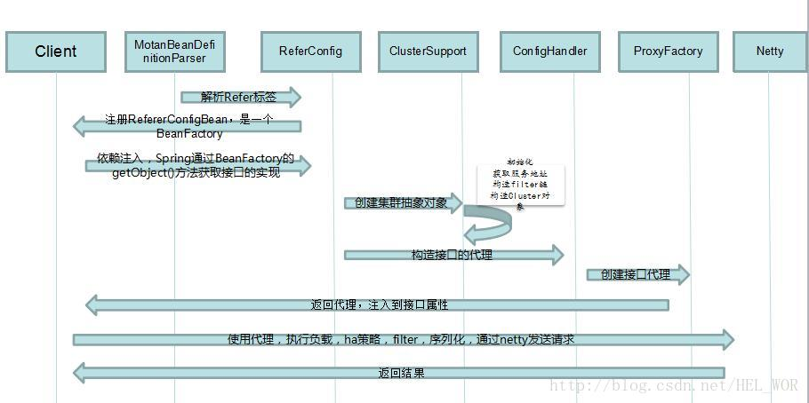

| 角色                | 描述                             | 
|--------------------|----------------------------------|
|注册中心(Registry)   |服务注册与发现的注册中心            |
|服务提供方(RPC Server) |暴露服务的服务提供方                |
|服务消费方(RPC Client) |调用远程服务的服务消费方            |

|功能列表 | 描述                |
|---------|---------------------|
|注册中心 |服务注册与发现的注册中心|
|Server端 |服务提供方            |
|Client端 |服务调用方            |

## 架构模块

### 公用相关模块

#### register模块
register 模块和注册中心进行交互，进行注册服务、订阅服务、服务变更通知、服务心跳发送等功能；
- Server 端会在系统初始化时通过 register 模块注册服务;
- Client 端在系统初始化时会通过 register 模块订阅具体服务的 Server 列表，当 Server 列表发生变更时也由 register 模块通知 Client。

#### protocol模块
protocol 模块用于进行 RPC 服务的描述和 RPC 服务的配置管理，及自定义 filter。

#### serialize模块
serialize 模块将 RPC 请求中的对象进行序列化与反序列化(默认hessian2);

#### transport模块
transport 模块用于远程通信，默认 Netty NIO 的 TCP 长链接方式.

### Client相关模块
> 进行 RPC 请求时，Client 通过代理机制调用 cluster 模块，cluster 根据配置的 HA 和 LoadBalance 选出一个可用的 Server，通过 serialize 模块把RPC 请求转换为字节流，然后通过 transport 模块发送到 Server 端。

#### cluster模块
cluster 是一组可用的 Server 封装, Client 根据不同的高可用与负载均衡策略选择一个可用的 Server 发起远程调用。

## 流程

### 客户端流程

### 服务端流程

