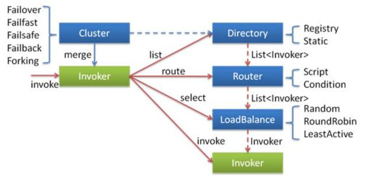

## 基本结构
| 组件                | 描述                             | 
|--------------------|----------------------------------|
|注册中心(Registry)   |服务注册与发现的注册中心            |
|服务提供方(Provider) |暴露服务的服务提供方                |
|服务消费方(Consumer) |调用远程服务的服务消费方            |
|监控(Monitor)       |统计服务的调用次调和调用时间的监控中心|
|容器(Container)      |服务运行时容器                     |

|功能    | 描述                          | 
|--------|-------------------------------|
|负载均衡 |将服务压力分摊到多台服务器进行执行|
|集群模式 |提供集群部署方式                |
|路由     |根据自定义规则配置调用节点       |
|服务降级 |临时屏蔽某个出错的非关键服务     |
|并发控制 |对并发情况进行控制              |

## 流程
1. 服务提供方发布服务到服务注册中心；
2. 服务消费方从服务注册中心订阅服务；
3. 服务消费方调用已经注册的可用服务。

## 注册中心
- 适配zookeeper
- redis
- multicast(组播传输)
- dubbo简易注册中心
  
注册中心通过特定协议来完成服务对外的统一,将服务统一管理起来，优化内部应用对服务发布/使用的流程和管理。

## 服务注册
根据协议信息绑定到配置的IP和端口上，如果已有服务绑定过相同IP和端口的则跳过.

## 服务调用
通过注册中心发现服务

## 服务监控
对服务端客户端的调用状态进行监控。

## 集群
提供集群部署策略

### 集群模式
- Failover Cluster模式:
调用失败时，自动切换，重新尝试调用其他节点上可用的服务。

- Failfast Cluster模式:
快速失败模式，调用只执行一次，失败则立即报错。

- Failsafe Cluster模式:
失败安全模式，调用失败,则直接忽略失败的调用，记录失败的调用到日志文件.

- Failback Cluster模式:
失败自动恢复，后台记录失败请求，定时重发。

- Forking Cluster模式:
并行调用多个服务器，只要一个成功即返回。

- Broadcast Cluster模式:
广播调用所有提供者，逐个调用，任意一台报错则报错。

### 负载均衡策略
> - Random LoadBalance
> 通过权重随机分配，配置值为random。

- RoundRobin LoadBalance 
轮询策略

- LeastActive LoadBalance
据请求调用的次数计数，处理请求更慢的节点会受到更少的请求。

- ConsistentHash LoadBalance
一致性Hash策略。相同调用参数的请求会发送到同一个服务提供方节点上，如果某个节点发生故障，则会基于一致性Hash算法映射到虚拟节点上。