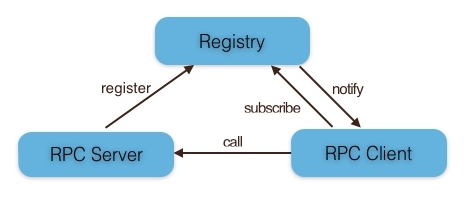
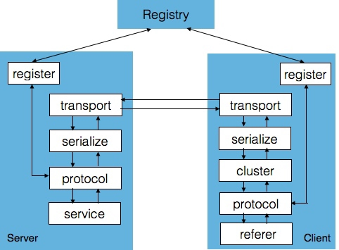
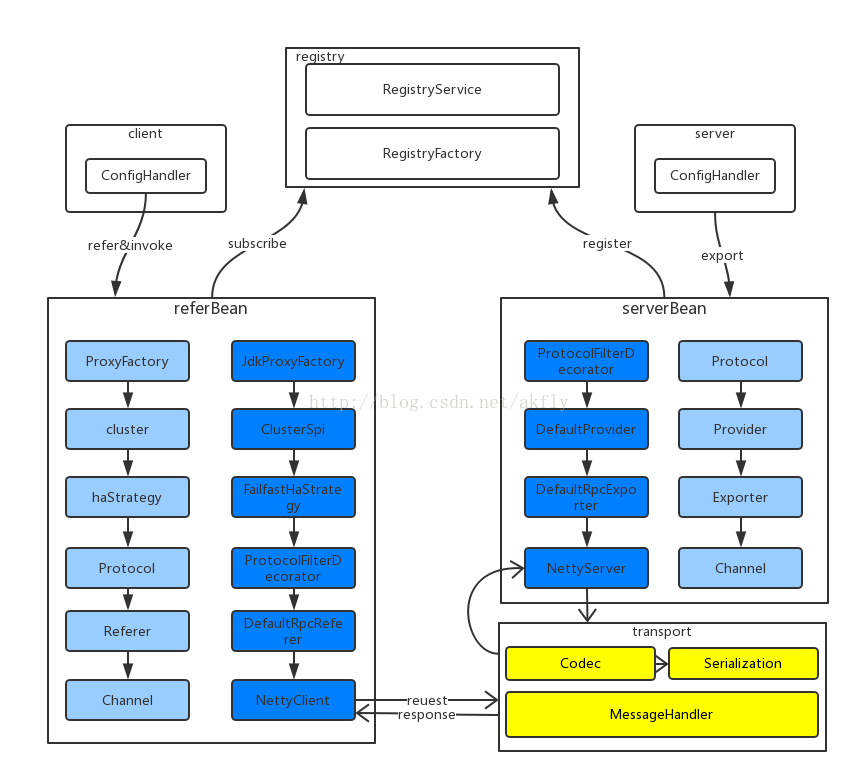
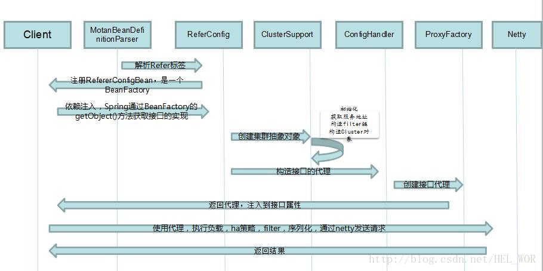
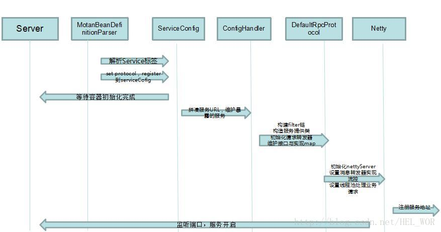

| 角色                | 描述                             | 
|--------------------|----------------------------------|
|注册中心(Registry)   |服务注册与发现的注册中心            |
|服务提供方(RPC Server) |暴露服务的服务提供方                |
|服务消费方(RPC Client) |调用远程服务的服务消费方            |

|功能列表   | 描述                |
|----------|---------------------|
|注册中心   |服务注册与发现的注册中心|
|Server端   |服务提供方            |
|Client端   |服务调用方            |
|集群负载均衡|提供高可用的集群    |

## 架构分层

公共组件：
- SPI：Service Provider Interface，通过ExtensionLoader提供扩展点功能，动态装载接口具体实现，提供客户端扩展能力。
- Logger：使用slf4j，提供整个框架统一的日志记录工具。
- Statistic：使用定时回调方式，收集和记录框架监控信息。
- URL：对协议，路径，参数的统一抽象，系统也使用URL来保存和读取配置信息。
- Switcher：提供开关控制服务，能够控制框架关键路径的升级和降级。
- Exception：统一异常处理，分为业务异常，框架异常，服务异常等。

各层作用:
- Config层：提供配置读取，解析，实体生成。
- Proxy层：服务端无proxy，客户端具有代理功能，通过InvocationHandler来拦截方法调用。
- Registry层：用来进行服务发现和注册，server端进行服务注册，client进行服务发现。目前有zk,consul的实现，还有对directUrl（就是p2p，不借助中心）的特殊处理。

## 模块

### 公用相关模块

#### register模块
register 模块和注册中心进行交互，进行注册服务、订阅服务、服务变更通知、服务心跳发送等功能；
- Server 端会在系统初始化时通过 register 模块注册服务;
- Client 端在系统初始化时会通过 register 模块订阅具体服务的 Server 列表，当 Server 列表发生变更时也由 register 模块通知 Client。

#### protocol模块
protocol 模块用于进行 RPC 服务的描述和 RPC 服务的配置管理，及自定义 filter。

#### serialize模块
serialize 模块将 RPC 请求中的对象进行序列化与反序列化(默认hessian2);

#### transport模块
transport 模块用于远程通信，默认 Netty NIO 的 TCP 长链接方式.

### Client相关模块
> 进行 RPC 请求时，Client 通过代理机制调用 cluster 模块，cluster 根据配置的 HA 和 LoadBalance 选出一个可用的 Server，通过 serialize 模块把RPC 请求转换为字节流，然后通过 transport 模块发送到 Server 端。

#### cluster模块
cluster 是一组可用的 Server 封装, Client 根据不同的高可用与负载均衡策略选择一个可用的 Server 发起远程调用。

#### referer模块
referer模块包含服务消费方对服务的引用

## server模块
> server相关模块将暴露服务并将服务信息(包含 IP、端口、服务策略等信息)注册到注册中心

## 高可用集群
- 支持ActiveWeight/Random/RoundRobin/LocalFirst/Consistent 策略.
- 自动集成 Failover、Failfast 容错策略
- 支持自定义扩展
- 故障节点自动摘除
- 自动探测恢复
- 故障隔离
- 连接池自定义控制
- 多机房间调用流量压缩
- 动态流量调整
- 跨 IDC

## 流程

### 客户端流程

### 服务端流程

## 相关技术

### 序列化
- hessian2

### 通讯协议
- Netty 作为 Endpoint
- 自定义的协议编码方式

### 配置方式
- spring 配置