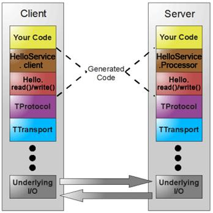

##thrift架构



如图所示，图中黄色部分是用户实现的业务逻辑，
褐色部分是根据Thrift定义的服务接口描述文件生成的客户端和服务器端代码框架，
红色部分是根据Thrift文件生成代码实现数据的读写操作。
红色部分以下是 Thrift 的传输体系、协议以及底层I/O通信，使用Thrift可以很方便的定义一个服务并且选择不同的传输协议和传输层而不用重新生成代码。

Thrift服务器包含用于绑定协议和传输层的基础架构，它提供阻塞、非阻塞、单线程和多线程的模式运行在服务器上，可以配合服务器 / 容器一起运行，可以和现有的 J2EE 服务器 /Web 容器无缝的结合。

##协议

Thrift 可以让用户选择客户端与服务端之间传输通信协议的类别，
在传输协议上总体划分为文本 (text) 和二进制 (binary) 传输协议，为节约带宽，提高传输效率，一般情况下使用二进制类型的传输协议为多数，有时还会使用基于文本类型的协议，这需要根据项目/产品中的实际需求。

常用协议有以下几种：
- TBinaryProtocol —— 二进制编码格式进行数据传输
创建服务器端实现代码
```Java
package service.server; 
import org.apache.thrift.TProcessor; 
import org.apache.thrift.protocol.TBinaryProtocol; 
import org.apache.thrift.protocol.TBinaryProtocol.Factory; 
import org.apache.thrift.server.TServer; 
import org.apache.thrift.server.TThreadPoolServer; 
import org.apache.thrift.transport.TServerSocket; 
import org.apache.thrift.transport.TTransportException; 
import service.demo.Hello; 
import service.demo.HelloServiceImpl; 
 
public class HelloServiceServer { 
   /** 
    * 启动 Thrift 服务器
    * @param args 
    */ 
   public static void main(String[] args) { 
       try { 
           // 设置服务端口为 7911 
           TServerSocket serverTransport = new TServerSocket(7911); 
           // 设置协议工厂为 TBinaryProtocol.Factory 
           Factory proFactory = new TBinaryProtocol.Factory(); 
           // 关联处理器与 Hello 服务的实现
           TProcessor processor = new Hello.Processor(new HelloServiceImpl()); 
           TServer server = new TThreadPoolServer(processor, serverTransport, 
                   proFactory); 
           System.out.println("Start server on port 7911..."); 
           server.serve(); 
       } catch (TTransportException e) { 
           e.printStackTrace(); 
       } 
   } 
}
```
创建客户端实现代码
```Java
package service.client; 
import org.apache.thrift.TException; 
import org.apache.thrift.protocol.TBinaryProtocol; 
import org.apache.thrift.protocol.TProtocol; 
import org.apache.thrift.transport.TSocket; 
import org.apache.thrift.transport.TTransport; 
import org.apache.thrift.transport.TTransportException; 
import service.demo.Hello; 
 
public class HelloServiceClient { 
/** 
    * 调用 Hello 服务
    * @param args 
    */ 
   public static void main(String[] args) { 
       try { 
           // 设置调用的服务地址为本地，端口为 7911 
           TTransport transport = new TSocket("localhost", 7911); 
           transport.open(); 
           // 设置传输协议为 TBinaryProtocol 
           TProtocol protocol = new TBinaryProtocol(transport); 
           Hello.Client client = new Hello.Client(protocol); 
           // 调用服务的 helloVoid 方法
           client.helloVoid(); 
           transport.close(); 
       } catch (TTransportException e) { 
           e.printStackTrace(); 
       } catch (TException e) { 
           e.printStackTrace(); 
       } 
   } 
}
```
- TCompactProtocol —— 高效率的、密集的二进制编码格式进行数据传输
构建 TCompactProtocol 协议的服务器和客户端只需上面代码中 TBinaryProtocol 协议部分即可，替换成如下代码：
```Java
TCompactProtocol.Factory proFactory = new TCompactProtocol.Factory();
TCompactProtocol protocol = new TCompactProtocol(transport);
```
- TJSONProtocol —— 使用 JSON 的数据编码协议进行数据传输
构建 TJSONProtocol 协议的服务器和客户端只需替换上面代码中 TBinaryProtocol 协议部分即可，替换成如下代码：
```Java
TJSONProtocol.Factory proFactory = new TJSONProtocol.Factory();
TJSONProtocol protocol = new TJSONProtocol(transport);
```
- TSimpleJSONProtocol —— 只提供 JSON 只写的协议，适用于通过脚本语言解析

##传输层
常用的传输层有以下几种：

- TSocket —— 使用阻塞式 I/O 进行传输，是最常见的模式
使用方法如上面代码

- TFramedTransport —— 使用非阻塞方式，按块的大小进行传输，类似于 Java 中的 NIO
若使用 TFramedTransport 传输层，其服务器必须修改为非阻塞的服务类型，客户端只需替上面客代码中 TTransport 部分，代码如下
TNonblockingServerTransport 类是构建非阻塞 socket 的抽象类，TNonblockingServerSocket 类继承 TNonblockingServerTransport
服务端
```Java
TNonblockingServerTransport serverTransport; 
serverTransport = new TNonblockingServerSocket(10005); 
Hello.Processor processor = new Hello.Processor(new HelloServiceImpl()); 
TServer server = new TNonblockingServer(processor, serverTransport); 
System.out.println("Start server on port 10005 ..."); 
server.serve();
```
客户端
```Java
TTransport transport = new TFramedTransport(new TSocket("localhost", 10005));
```
- TNonblockingTransport —— 使用非阻塞方式，用于构建异步客户端

## 服务端类型
常见的服务端类型有以下几种：
- TSimpleServer —— 单线程服务器端使用标准的阻塞式 I/O
```Java
TServerSocket serverTransport = new TServerSocket(7911); 
TProcessor processor = new Hello.Processor(new HelloServiceImpl()); 
TServer server = new TSimpleServer(processor, serverTransport); 
System.out.println("Start server on port 7911..."); 
server.serve();
```
- TThreadPoolServer —— 多线程服务器端使用标准的阻塞式 I/O
- TNonblockingServer —— 多线程服务器端使用非阻塞式 I/O

