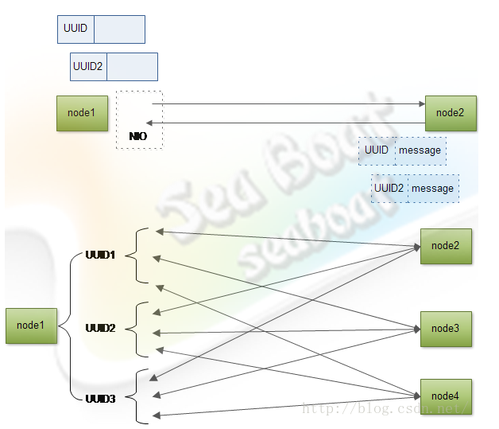
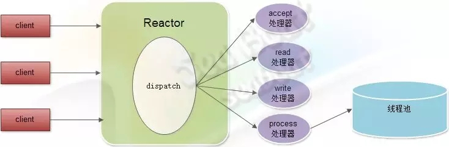

# 相关问题收集

## 多线程

### 问题
因为NIO通信框架不会每个线程都独自使用一个socket通道，为提高性能一般都是使
用长连接，所有线程共用一个socket通道，这时就算线程一比线程二先放入通信框架
也不能保证响应一比响应二先接收到，所以接收到响应一后不知道该通知线程一还是
线程二。

线程与响应对应的问题就需要维护一个线程响应关系列表，响应从关系列表中就能
查找对应的线程，如图，在发送之前生成一个UUID标识，此标识要保证同socket中
唯一，再把UUID与线程对象关系对应起来，可使用Map数据结构实现，UUID的值作为
key，线程对应的锁对象为value。接着制定一个协议报文，UUID作为报文的其中一
部分，报文发往另一个节点node2后将响应信息message放入报文中并返回，node1对
接收到的报文进行解包根据UUID去查找并唤起对应的线程，告诉它“你要的消息已经
收到，往下处理吧”。但在集群环境下，我们更希望是集群中所有节点的消息都接收到
了才往下处理，如图下半部分，一个UUID1的请求报文会发往node2、node3和node4三
个节点，这时假如只接收到一个响应则不唤起线程，直到node2、node3对应UUID1的
响应报文都接收到后才唤起对应线程往下执行。同样地，UUID2、UUID3的报文消息都
是如此处理，最后集群中对应的响应都能正确回到各自线程上。

## 问题
Reactor模式有个不容忽视的缺点，比如处理耗时较长操作的处理器有可能会影响到整体的
处理能力，所以需要在process处理器中引入一个线程池，并将比较耗时的操作放到线程池
中处理，从而使得Reactor的整体运转处于正常状态。

